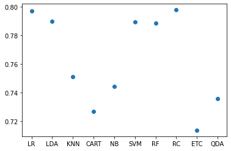
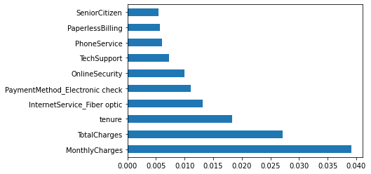
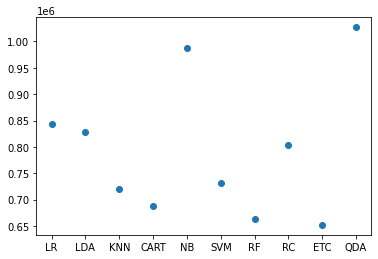

First we import the important libraries - numpy and pandas.


```python
import numpy as np # linear algebra
import pandas as pd # data processing, CSV file I/O (e.g. pd.read_csv)
import plotly.express as px
```

Next, we load the data and have a look at the first 5 rows of the data. From the data we can see that the `Churn` variable which is our dependent variable.


```python
data = pd.read_csv("../input/telco-customer-churn/WA_Fn-UseC_-Telco-Customer-Churn.csv")
data.head()
```


<div>
<table border="1" class="dataframe">
  <thead>
    <tr style="text-align: right;">
      <th></th>
      <th>customerID</th>
      <th>gender</th>
      <th>SeniorCitizen</th>
      <th>Partner</th>
      <th>Dependents</th>
      <th>tenure</th>
      <th>PhoneService</th>
      <th>MultipleLines</th>
      <th>InternetService</th>
      <th>OnlineSecurity</th>
      <th>...</th>
      <th>DeviceProtection</th>
      <th>TechSupport</th>
      <th>StreamingTV</th>
      <th>StreamingMovies</th>
      <th>Contract</th>
      <th>PaperlessBilling</th>
      <th>PaymentMethod</th>
      <th>MonthlyCharges</th>
      <th>TotalCharges</th>
      <th>Churn</th>
    </tr>
  </thead>
  <tbody>
    <tr>
      <th>0</th>
      <td>7590-VHVEG</td>
      <td>Female</td>
      <td>0</td>
      <td>Yes</td>
      <td>No</td>
      <td>1</td>
      <td>No</td>
      <td>No phone service</td>
      <td>DSL</td>
      <td>No</td>
      <td>...</td>
      <td>No</td>
      <td>No</td>
      <td>No</td>
      <td>No</td>
      <td>Month-to-month</td>
      <td>Yes</td>
      <td>Electronic check</td>
      <td>29.85</td>
      <td>29.85</td>
      <td>No</td>
    </tr>
    <tr>
      <th>1</th>
      <td>5575-GNVDE</td>
      <td>Male</td>
      <td>0</td>
      <td>No</td>
      <td>No</td>
      <td>34</td>
      <td>Yes</td>
      <td>No</td>
      <td>DSL</td>
      <td>Yes</td>
      <td>...</td>
      <td>Yes</td>
      <td>No</td>
      <td>No</td>
      <td>No</td>
      <td>One year</td>
      <td>No</td>
      <td>Mailed check</td>
      <td>56.95</td>
      <td>1889.5</td>
      <td>No</td>
    </tr>
    <tr>
      <th>2</th>
      <td>3668-QPYBK</td>
      <td>Male</td>
      <td>0</td>
      <td>No</td>
      <td>No</td>
      <td>2</td>
      <td>Yes</td>
      <td>No</td>
      <td>DSL</td>
      <td>Yes</td>
      <td>...</td>
      <td>No</td>
      <td>No</td>
      <td>No</td>
      <td>No</td>
      <td>Month-to-month</td>
      <td>Yes</td>
      <td>Mailed check</td>
      <td>53.85</td>
      <td>108.15</td>
      <td>Yes</td>
    </tr>
    <tr>
      <th>3</th>
      <td>7795-CFOCW</td>
      <td>Male</td>
      <td>0</td>
      <td>No</td>
      <td>No</td>
      <td>45</td>
      <td>No</td>
      <td>No phone service</td>
      <td>DSL</td>
      <td>Yes</td>
      <td>...</td>
      <td>Yes</td>
      <td>Yes</td>
      <td>No</td>
      <td>No</td>
      <td>One year</td>
      <td>No</td>
      <td>Bank transfer (automatic)</td>
      <td>42.30</td>
      <td>1840.75</td>
      <td>No</td>
    </tr>
    <tr>
      <th>4</th>
      <td>9237-HQITU</td>
      <td>Female</td>
      <td>0</td>
      <td>No</td>
      <td>No</td>
      <td>2</td>
      <td>Yes</td>
      <td>No</td>
      <td>Fiber optic</td>
      <td>No</td>
      <td>...</td>
      <td>No</td>
      <td>No</td>
      <td>No</td>
      <td>No</td>
      <td>Month-to-month</td>
      <td>Yes</td>
      <td>Electronic check</td>
      <td>70.70</td>
      <td>151.65</td>
      <td>Yes</td>
    </tr>
  </tbody>
</table>
<p>5 rows × 21 columns</p>
</div>


Currently, we have no information about the data. Hence, we will now look at the type of columns the data has. This will tell us if our data has some categorical variable or not. Also, a lot of time some variables are also mistaken for different data types. This step will help us in catching that. We will also look at how many  categories each categorial data type has.


```python
print(data.dtypes)
print(data.select_dtypes("object").nunique())
```

    customerID           object
    gender               object
    SeniorCitizen         int64
    Partner              object
    Dependents           object
    tenure                int64
    PhoneService         object
    MultipleLines        object
    InternetService      object
    OnlineSecurity       object
    OnlineBackup         object
    DeviceProtection     object
    TechSupport          object
    StreamingTV          object
    StreamingMovies      object
    Contract             object
    PaperlessBilling     object
    PaymentMethod        object
    MonthlyCharges      float64
    TotalCharges         object
    Churn                object
    dtype: object


    customerID          7043
    gender                 2
    Partner                2
    Dependents             2
    PhoneService           2
    MultipleLines          3
    InternetService        3
    OnlineSecurity         3
    OnlineBackup           3
    DeviceProtection       3
    TechSupport            3
    StreamingTV            3
    StreamingMovies        3
    Contract               3
    PaperlessBilling       2
    PaymentMethod          4
    TotalCharges        6531
    Churn                  2
    dtype: int64


From the output we can see that there are categorical variables which have the data type `object`. From the second table, we can see the number of categories each categorical column has. Here we see that `TotalCharge` has `6531` types of categories, which does not makes sense. This is because it should be a numerical variable, i.e., have data types like `int` or `float`. This means that this variable has been parsed as a string variable. Hence, we will correct this by changing it to a numeric data type. Also, certain times when one changes the data type from string to a numeric data type.


```python
## Checking how many rows are null or not
data["TotalCharges"] = pd.to_numeric(data["TotalCharges"], errors = "coerce").fillna(0)
```


```python

## Checking how many rows are null or not
print((data.isnull().sum(axis = 0) == 0).all()) ## No columns have NA values
# Checking the number of unique customers
print(data.customerID.unique().size == data.shape[0]) ## All rows are unique customers
```

    True
    True


```python
fig = px.scatter(x=data['tenure'], y=data['TotalCharges'], 
                 color = data['Churn'], template = 'presentation', 
                 opacity = 0.5, facet_col = data['Contract'], 
                 title = 'Customer Churn by Tenure, Charges, and Contract Type',
                 labels = {'x' : 'Customer Tenure', 'y' : 'Total Charges $'})
fig.show()
```


# Data Cleaning and Transformation


```python
data["MultipleLines"] = data["MultipleLines"].replace(['No phone service'], "No")
colz = ['OnlineSecurity', 'OnlineBackup', 'DeviceProtection', 'TechSupport', 'StreamingTV', 'StreamingMovies']
data[colz] = data[colz].replace(['No internet service'], 'No')

data.gender = np.where(data.gender == "Male", 1, 0)
# Make variables with two classes into dummy variables
data.iloc[:, [3, 4, 6, 7, 9, 10, 11, 12, 13, 14, 16, 20]] = np.where(data.iloc[:, [3, 4, 6, 7, 9, 10, 11, 12, 13, 14, 16, 20]] == "Yes", 1, 0)

## Creating dummies for variables with more than two classes
data = pd.get_dummies(data, columns = ['InternetService', 'Contract', 'PaymentMethod'])
data.drop(data.columns[[0, 20, 21, 24]], axis=1, inplace=True) ## drop one base class and customerID
```

Hence, a company should try to promote their one year/two year contracts as people with those contract are less likely churn.

# Data Preprocessing


```python
from sklearn import preprocessing
from sklearn.model_selection import train_test_split
from sklearn.metrics import confusion_matrix

y = data["Churn"]
data.drop(["Churn"], axis = 1, inplace=True)

colz = ["tenure", "MonthlyCharges", "TotalCharges"]
scaler = preprocessing.StandardScaler().fit(data[colz])
data[colz] = scaler.transform(data[colz])

X_train, X_test, y_train, y_test = train_test_split(data, y, test_size=0.25, random_state=0)
```

# Classifiers - Model Comparisons


```python
from sklearn.linear_model import LogisticRegression
from sklearn.tree import DecisionTreeClassifier
from sklearn.neighbors import KNeighborsClassifier
from sklearn.discriminant_analysis import LinearDiscriminantAnalysis
from sklearn.naive_bayes import GaussianNB
from sklearn.svm import SVC
from sklearn.ensemble import RandomForestClassifier
from sklearn.linear_model import RidgeClassifier
from sklearn.tree import ExtraTreeClassifier
from sklearn.discriminant_analysis import QuadraticDiscriminantAnalysis

models = [
    ('LR', LogisticRegression(random_state=0)),
    ('LDA', LinearDiscriminantAnalysis()),
    ('KNN', KNeighborsClassifier()),
    ('CART', DecisionTreeClassifier(random_state=0)),
    ('NB', GaussianNB()),
    ('SVM', SVC(random_state=0)),
    ("RF", RandomForestClassifier(n_estimators=150, min_samples_leaf=50, oob_score=True, n_jobs=-1, random_state=0)),
    ("RC", RidgeClassifier(random_state=0)),
    ("ETC", ExtraTreeClassifier(random_state=0)),
    ("QDA", QuadraticDiscriminantAnalysis())
]
```


```python
names = []
test_results = []
for name, model in models:
    model.fit(X_train, y_train)
    rez = model.score(X_test, y_test)
    test_results.append(rez)
    names.append(name)
    msg = "%s: %f" % (name, rez)
    print(msg)
```

    LR: 0.797274
    LDA: 0.789892
    KNN: 0.751278
    CART: 0.726860
    NB: 0.744463
    SVM: 0.789324
    RF: 0.788756
    RC: 0.797842
    ETC: 0.713799
    QDA: 0.735945


```python
import matplotlib.pyplot as plt

plt.scatter(names, test_results)
```


    <matplotlib.collections.PathCollection at 0x7ff0846b8510>


    

    


```python
score_res = pd.DataFrame(list(zip(names, test_results, range(0, len(models)))), columns = ["Model", "Score", "Index"])
score_res.sort_values(by = "Score", ascending = False, inplace=True)
```

# Hyperparameter Tuning
### Grid Search CV


```python
from sklearn.model_selection import GridSearchCV
searchspace = {"alpha": np.linspace(10, 100, 10)}
#searchspace = {'alpha' : [0.1, 0.2, 0.4, 0.8]}
GS = GridSearchCV(models[score_res.iloc[0, 2]][1], ## model with the highest accuracy
                 param_grid=searchspace,
                  scoring=["accuracy"],
                  refit="accuracy",
                  cv=5,
                  verbose=4
                 )
GS.fit(X_train, y_train)
```

    Fitting 5 folds for each of 10 candidates, totalling 50 fits
    [CV 1/5] END ..............alpha=10.0; accuracy: (test=0.804) total time=   0.0s
    [CV 2/5] END ..............alpha=10.0; accuracy: (test=0.793) total time=   0.0s
    [CV 3/5] END ..............alpha=10.0; accuracy: (test=0.799) total time=   0.0s
    [CV 4/5] END ..............alpha=10.0; accuracy: (test=0.786) total time=   0.2s
    [CV 5/5] END ..............alpha=10.0; accuracy: (test=0.819) total time=   0.0s
    [CV 1/5] END ..............alpha=20.0; accuracy: (test=0.804) total time=   0.0s
    [CV 2/5] END ..............alpha=20.0; accuracy: (test=0.793) total time=   0.0s
    [CV 3/5] END ..............alpha=20.0; accuracy: (test=0.801) total time=   0.0s
    [CV 4/5] END ..............alpha=20.0; accuracy: (test=0.785) total time=   0.0s
    [CV 5/5] END ..............alpha=20.0; accuracy: (test=0.819) total time=   0.0s
    [CV 1/5] END ..............alpha=30.0; accuracy: (test=0.806) total time=   0.0s
    [CV 2/5] END ..............alpha=30.0; accuracy: (test=0.793) total time=   0.0s
    [CV 3/5] END ..............alpha=30.0; accuracy: (test=0.801) total time=   0.0s
    [CV 4/5] END ..............alpha=30.0; accuracy: (test=0.785) total time=   0.0s
    [CV 5/5] END ..............alpha=30.0; accuracy: (test=0.820) total time=   0.0s
    [CV 1/5] END ..............alpha=40.0; accuracy: (test=0.806) total time=   0.0s
    [CV 2/5] END ..............alpha=40.0; accuracy: (test=0.794) total time=   0.0s
    [CV 3/5] END ..............alpha=40.0; accuracy: (test=0.802) total time=   0.0s
    [CV 4/5] END ..............alpha=40.0; accuracy: (test=0.786) total time=   0.0s
    [CV 5/5] END ..............alpha=40.0; accuracy: (test=0.817) total time=   0.0s
    [CV 1/5] END ..............alpha=50.0; accuracy: (test=0.807) total time=   0.0s
    [CV 2/5] END ..............alpha=50.0; accuracy: (test=0.794) total time=   0.0s
    [CV 3/5] END ..............alpha=50.0; accuracy: (test=0.801) total time=   0.0s
    [CV 4/5] END ..............alpha=50.0; accuracy: (test=0.785) total time=   0.0s
    [CV 5/5] END ..............alpha=50.0; accuracy: (test=0.817) total time=   0.0s
    [CV 1/5] END ..............alpha=60.0; accuracy: (test=0.807) total time=   0.0s
    [CV 2/5] END ..............alpha=60.0; accuracy: (test=0.793) total time=   0.0s
    [CV 3/5] END ..............alpha=60.0; accuracy: (test=0.801) total time=   0.0s
    [CV 4/5] END ..............alpha=60.0; accuracy: (test=0.790) total time=   0.0s
    [CV 5/5] END ..............alpha=60.0; accuracy: (test=0.817) total time=   0.0s
    [CV 1/5] END ..............alpha=70.0; accuracy: (test=0.808) total time=   0.0s
    [CV 2/5] END ..............alpha=70.0; accuracy: (test=0.793) total time=   0.0s
    [CV 3/5] END ..............alpha=70.0; accuracy: (test=0.801) total time=   0.0s
    [CV 4/5] END ..............alpha=70.0; accuracy: (test=0.791) total time=   0.0s
    [CV 5/5] END ..............alpha=70.0; accuracy: (test=0.817) total time=   0.0s
    [CV 1/5] END ..............alpha=80.0; accuracy: (test=0.807) total time=   0.0s
    [CV 2/5] END ..............alpha=80.0; accuracy: (test=0.793) total time=   0.0s
    [CV 3/5] END ..............alpha=80.0; accuracy: (test=0.803) total time=   0.0s
    [CV 4/5] END ..............alpha=80.0; accuracy: (test=0.792) total time=   0.0s
    [CV 5/5] END ..............alpha=80.0; accuracy: (test=0.817) total time=   0.0s
    [CV 1/5] END ..............alpha=90.0; accuracy: (test=0.807) total time=   0.0s
    [CV 2/5] END ..............alpha=90.0; accuracy: (test=0.792) total time=   0.0s
    [CV 3/5] END ..............alpha=90.0; accuracy: (test=0.803) total time=   0.0s
    [CV 4/5] END ..............alpha=90.0; accuracy: (test=0.793) total time=   0.0s
    [CV 5/5] END ..............alpha=90.0; accuracy: (test=0.818) total time=   0.0s
    [CV 1/5] END .............alpha=100.0; accuracy: (test=0.809) total time=   0.0s
    [CV 2/5] END .............alpha=100.0; accuracy: (test=0.793) total time=   0.0s
    [CV 3/5] END .............alpha=100.0; accuracy: (test=0.803) total time=   0.0s
    [CV 4/5] END .............alpha=100.0; accuracy: (test=0.794) total time=   0.0s
    [CV 5/5] END .............alpha=100.0; accuracy: (test=0.816) total time=   0.0s


    GridSearchCV(cv=5, estimator=RidgeClassifier(random_state=0),
                 param_grid={'alpha': array([ 10.,  20.,  30.,  40.,  50.,  60.,  70.,  80.,  90., 100.])},
                 refit='accuracy', scoring=['accuracy'], verbose=4)


```python
print(GS.best_params_)
print(GS.best_score_)
```

    {'alpha': 100.0}
    0.8029163441415097


```python
pd.DataFrame(GS.cv_results_)
```


<div>
<style scoped>
    .dataframe tbody tr th:only-of-type {
        vertical-align: middle;
    }

    .dataframe tbody tr th {
        vertical-align: top;
    }

    .dataframe thead th {
        text-align: right;
    }
</style>
<table border="1" class="dataframe">
  <thead>
    <tr style="text-align: right;">
      <th></th>
      <th>mean_fit_time</th>
      <th>std_fit_time</th>
      <th>mean_score_time</th>
      <th>std_score_time</th>
      <th>param_alpha</th>
      <th>params</th>
      <th>split0_test_accuracy</th>
      <th>split1_test_accuracy</th>
      <th>split2_test_accuracy</th>
      <th>split3_test_accuracy</th>
      <th>split4_test_accuracy</th>
      <th>mean_test_accuracy</th>
      <th>std_test_accuracy</th>
      <th>rank_test_accuracy</th>
    </tr>
  </thead>
  <tbody>
    <tr>
      <th>0</th>
      <td>0.012709</td>
      <td>0.001887</td>
      <td>0.043498</td>
      <td>0.077409</td>
      <td>10.0</td>
      <td>{'alpha': 10.0}</td>
      <td>0.804163</td>
      <td>0.792810</td>
      <td>0.799242</td>
      <td>0.785985</td>
      <td>0.819129</td>
      <td>0.800266</td>
      <td>0.011239</td>
      <td>10</td>
    </tr>
    <tr>
      <th>1</th>
      <td>0.013658</td>
      <td>0.000190</td>
      <td>0.004644</td>
      <td>0.000090</td>
      <td>20.0</td>
      <td>{'alpha': 20.0}</td>
      <td>0.804163</td>
      <td>0.792810</td>
      <td>0.801136</td>
      <td>0.785038</td>
      <td>0.819129</td>
      <td>0.800455</td>
      <td>0.011481</td>
      <td>9</td>
    </tr>
    <tr>
      <th>2</th>
      <td>0.013796</td>
      <td>0.000329</td>
      <td>0.004666</td>
      <td>0.000065</td>
      <td>30.0</td>
      <td>{'alpha': 30.0}</td>
      <td>0.806055</td>
      <td>0.792810</td>
      <td>0.801136</td>
      <td>0.785038</td>
      <td>0.820076</td>
      <td>0.801023</td>
      <td>0.011927</td>
      <td>6</td>
    </tr>
    <tr>
      <th>3</th>
      <td>0.014006</td>
      <td>0.000259</td>
      <td>0.004775</td>
      <td>0.000062</td>
      <td>40.0</td>
      <td>{'alpha': 40.0}</td>
      <td>0.806055</td>
      <td>0.793756</td>
      <td>0.802083</td>
      <td>0.785985</td>
      <td>0.817235</td>
      <td>0.801023</td>
      <td>0.010660</td>
      <td>7</td>
    </tr>
    <tr>
      <th>4</th>
      <td>0.013671</td>
      <td>0.000192</td>
      <td>0.004759</td>
      <td>0.000168</td>
      <td>50.0</td>
      <td>{'alpha': 50.0}</td>
      <td>0.807001</td>
      <td>0.793756</td>
      <td>0.801136</td>
      <td>0.785038</td>
      <td>0.817235</td>
      <td>0.800833</td>
      <td>0.011016</td>
      <td>8</td>
    </tr>
    <tr>
      <th>5</th>
      <td>0.014350</td>
      <td>0.000557</td>
      <td>0.004810</td>
      <td>0.000031</td>
      <td>60.0</td>
      <td>{'alpha': 60.0}</td>
      <td>0.807001</td>
      <td>0.792810</td>
      <td>0.801136</td>
      <td>0.789773</td>
      <td>0.817235</td>
      <td>0.801591</td>
      <td>0.009909</td>
      <td>5</td>
    </tr>
    <tr>
      <th>6</th>
      <td>0.014054</td>
      <td>0.000279</td>
      <td>0.004778</td>
      <td>0.000169</td>
      <td>70.0</td>
      <td>{'alpha': 70.0}</td>
      <td>0.807947</td>
      <td>0.792810</td>
      <td>0.801136</td>
      <td>0.790720</td>
      <td>0.817235</td>
      <td>0.801970</td>
      <td>0.009797</td>
      <td>4</td>
    </tr>
    <tr>
      <th>7</th>
      <td>0.014222</td>
      <td>0.000520</td>
      <td>0.005748</td>
      <td>0.001993</td>
      <td>80.0</td>
      <td>{'alpha': 80.0}</td>
      <td>0.807001</td>
      <td>0.792810</td>
      <td>0.803030</td>
      <td>0.791667</td>
      <td>0.817235</td>
      <td>0.802349</td>
      <td>0.009474</td>
      <td>3</td>
    </tr>
    <tr>
      <th>8</th>
      <td>0.014254</td>
      <td>0.000446</td>
      <td>0.004800</td>
      <td>0.000085</td>
      <td>90.0</td>
      <td>{'alpha': 90.0}</td>
      <td>0.807001</td>
      <td>0.791864</td>
      <td>0.803030</td>
      <td>0.792614</td>
      <td>0.818182</td>
      <td>0.802538</td>
      <td>0.009771</td>
      <td>2</td>
    </tr>
    <tr>
      <th>9</th>
      <td>0.013920</td>
      <td>0.000169</td>
      <td>0.005718</td>
      <td>0.001958</td>
      <td>100.0</td>
      <td>{'alpha': 100.0}</td>
      <td>0.808893</td>
      <td>0.792810</td>
      <td>0.803030</td>
      <td>0.793561</td>
      <td>0.816288</td>
      <td>0.802916</td>
      <td>0.008991</td>
      <td>1</td>
    </tr>
  </tbody>
</table>
</div>


```python
selected_model = RidgeClassifier(alpha = 100, random_state=0)
selected_model.get_params()
selected_model.fit(X_train, y_train)
predicted_y = selected_model.predict(X_test)
print(selected_model.score(X_test, y_test))
print(confusion_matrix(y_test, predicted_y))
```

    0.7995457126632595
    [[1182  116]
     [ 237  226]]


### Feature Importance


```python
from sklearn.inspection import permutation_importance
r = permutation_importance(selected_model, X_test, y_test, n_repeats=30, random_state=0, scoring="accuracy")
```


```python
for i in r.importances_mean.argsort()[::-1]:
    if r.importances_mean[i] - 2 * r.importances_std[i] > 0:
        print(f"{data.columns[i]:<8}"
        f"{r.importances_mean[i]:.3f}"
        f" +/- {r.importances_std[i]:.3f}")

importance = pd.DataFrame(list(zip(data.columns, r.importances_mean, r.importances_std)), columns = ["Feature", "ImportanceMean", "ImportanceStd"])
importance.sort_values(by = "ImportanceMean", ascending=False, inplace=True)
importance
```

    MonthlyCharges0.039 +/- 0.005
    TotalCharges0.027 +/- 0.004
    tenure  0.018 +/- 0.004
    InternetService_Fiber optic0.013 +/- 0.004
    PaymentMethod_Electronic check0.011 +/- 0.003
    OnlineSecurity0.010 +/- 0.002
    TechSupport0.007 +/- 0.003
    PhoneService0.006 +/- 0.002
    PaperlessBilling0.006 +/- 0.002
    SeniorCitizen0.005 +/- 0.002
    DeviceProtection0.002 +/- 0.001


<div>
<style scoped>
    .dataframe tbody tr th:only-of-type {
        vertical-align: middle;
    }

    .dataframe tbody tr th {
        vertical-align: top;
    }

    .dataframe thead th {
        text-align: right;
    }
</style>
<table border="1" class="dataframe">
  <thead>
    <tr style="text-align: right;">
      <th></th>
      <th>Feature</th>
      <th>ImportanceMean</th>
      <th>ImportanceStd</th>
    </tr>
  </thead>
  <tbody>
    <tr>
      <th>14</th>
      <td>MonthlyCharges</td>
      <td>0.039088</td>
      <td>0.004550</td>
    </tr>
    <tr>
      <th>15</th>
      <td>TotalCharges</td>
      <td>0.027106</td>
      <td>0.004490</td>
    </tr>
    <tr>
      <th>4</th>
      <td>tenure</td>
      <td>0.018285</td>
      <td>0.004467</td>
    </tr>
    <tr>
      <th>17</th>
      <td>InternetService_Fiber optic</td>
      <td>0.013193</td>
      <td>0.003723</td>
    </tr>
    <tr>
      <th>21</th>
      <td>PaymentMethod_Electronic check</td>
      <td>0.011092</td>
      <td>0.003004</td>
    </tr>
    <tr>
      <th>7</th>
      <td>OnlineSecurity</td>
      <td>0.009994</td>
      <td>0.002071</td>
    </tr>
    <tr>
      <th>10</th>
      <td>TechSupport</td>
      <td>0.007250</td>
      <td>0.002568</td>
    </tr>
    <tr>
      <th>5</th>
      <td>PhoneService</td>
      <td>0.006019</td>
      <td>0.001887</td>
    </tr>
    <tr>
      <th>13</th>
      <td>PaperlessBilling</td>
      <td>0.005716</td>
      <td>0.002299</td>
    </tr>
    <tr>
      <th>1</th>
      <td>SeniorCitizen</td>
      <td>0.005376</td>
      <td>0.001676</td>
    </tr>
    <tr>
      <th>18</th>
      <td>Contract_One year</td>
      <td>0.003861</td>
      <td>0.002278</td>
    </tr>
    <tr>
      <th>16</th>
      <td>InternetService_DSL</td>
      <td>0.003729</td>
      <td>0.001910</td>
    </tr>
    <tr>
      <th>6</th>
      <td>MultipleLines</td>
      <td>0.003407</td>
      <td>0.002145</td>
    </tr>
    <tr>
      <th>19</th>
      <td>Contract_Two year</td>
      <td>0.003275</td>
      <td>0.002572</td>
    </tr>
    <tr>
      <th>8</th>
      <td>OnlineBackup</td>
      <td>0.003161</td>
      <td>0.003029</td>
    </tr>
    <tr>
      <th>3</th>
      <td>Dependents</td>
      <td>0.002707</td>
      <td>0.002003</td>
    </tr>
    <tr>
      <th>9</th>
      <td>DeviceProtection</td>
      <td>0.002404</td>
      <td>0.001179</td>
    </tr>
    <tr>
      <th>20</th>
      <td>PaymentMethod_Credit card (automatic)</td>
      <td>0.002271</td>
      <td>0.001218</td>
    </tr>
    <tr>
      <th>11</th>
      <td>StreamingTV</td>
      <td>0.001495</td>
      <td>0.001371</td>
    </tr>
    <tr>
      <th>22</th>
      <td>PaymentMethod_Mailed check</td>
      <td>0.000928</td>
      <td>0.000967</td>
    </tr>
    <tr>
      <th>0</th>
      <td>gender</td>
      <td>0.000663</td>
      <td>0.001245</td>
    </tr>
    <tr>
      <th>2</th>
      <td>Partner</td>
      <td>0.000568</td>
      <td>0.000688</td>
    </tr>
    <tr>
      <th>12</th>
      <td>StreamingMovies</td>
      <td>0.000227</td>
      <td>0.000477</td>
    </tr>
  </tbody>
</table>
</div>


```python
importance = pd.Series(r.importances_mean, index = data.columns)
```


```python
importance.nlargest(10).sort_values(ascending=False).plot(kind = "barh")
```


    <AxesSubplot:>


    

    


# Adding a New Metric


```python
from sklearn.metrics import make_scorer
# Profit Metric
def profit(y, y_pred):
    tp = np.where((y_pred==1) & (y==1), (5000-1000), 0)
    fp = np.where((y_pred==1) & (y==0), -1000, 0)
    return np.sum([tp,fp])

profit_scorer = make_scorer(profit)
```


```python
prf_names = []
prf_test_results = []
for name, model in models:
    model.fit(X_train, y_train)
    y_predicted = model.predict(X_test)
    rez = profit(y_test, y_predicted)
    prf_test_results.append(rez)
    prf_names.append(name)
    msg = "%s: %f" % (name, rez)
    print(msg)
```

    LR: 844000.000000
    LDA: 828000.000000
    KNN: 721000.000000
    CART: 687000.000000
    NB: 988000.000000
    SVM: 731000.000000
    RF: 664000.000000
    RC: 803000.000000
    ETC: 652000.000000
    QDA: 1027000.000000


```python
plt.scatter(prf_names, prf_test_results)
```


    <matplotlib.collections.PathCollection at 0x7ff084ef2390>


    

    


```python
prf_score_res = pd.DataFrame(list(zip(prf_names, prf_test_results, range(0, len(models)))), columns = ["Model", "Profit", "Index"])
prf_score_res.sort_values(by = "Profit", ascending = False, inplace=True)
prf_score_res
```


<div>
<style scoped>
    .dataframe tbody tr th:only-of-type {
        vertical-align: middle;
    }

    .dataframe tbody tr th {
        vertical-align: top;
    }

    .dataframe thead th {
        text-align: right;
    }
</style>
<table border="1" class="dataframe">
  <thead>
    <tr style="text-align: right;">
      <th></th>
      <th>Model</th>
      <th>Profit</th>
      <th>Index</th>
    </tr>
  </thead>
  <tbody>
    <tr>
      <th>9</th>
      <td>QDA</td>
      <td>1027000</td>
      <td>9</td>
    </tr>
    <tr>
      <th>4</th>
      <td>NB</td>
      <td>988000</td>
      <td>4</td>
    </tr>
    <tr>
      <th>0</th>
      <td>LR</td>
      <td>844000</td>
      <td>0</td>
    </tr>
    <tr>
      <th>1</th>
      <td>LDA</td>
      <td>828000</td>
      <td>1</td>
    </tr>
    <tr>
      <th>7</th>
      <td>RC</td>
      <td>803000</td>
      <td>7</td>
    </tr>
    <tr>
      <th>5</th>
      <td>SVM</td>
      <td>731000</td>
      <td>5</td>
    </tr>
    <tr>
      <th>2</th>
      <td>KNN</td>
      <td>721000</td>
      <td>2</td>
    </tr>
    <tr>
      <th>3</th>
      <td>CART</td>
      <td>687000</td>
      <td>3</td>
    </tr>
    <tr>
      <th>6</th>
      <td>RF</td>
      <td>664000</td>
      <td>6</td>
    </tr>
    <tr>
      <th>8</th>
      <td>ETC</td>
      <td>652000</td>
      <td>8</td>
    </tr>
  </tbody>
</table>
</div>


```python
confusion_matrix(y_test, models[prf_score_res.iloc[0, 2]][1].predict(X_test))
```


    array([[953, 345],
           [120, 343]])


